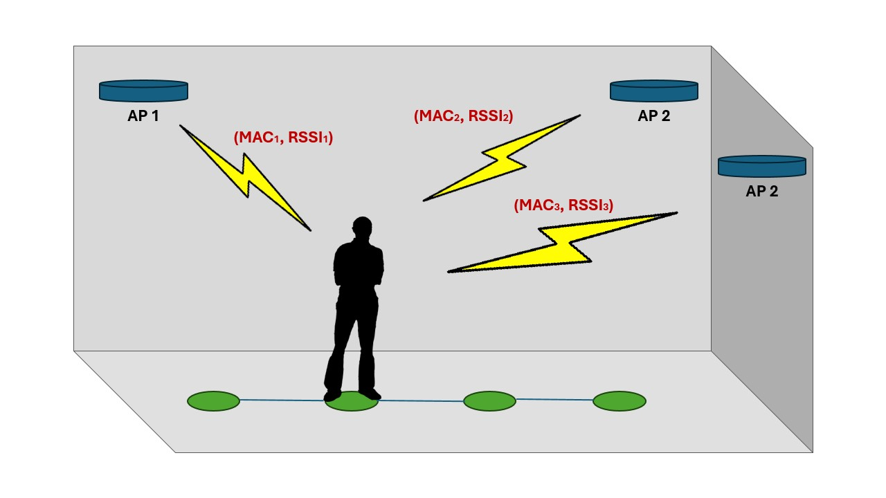

# ESP32 Indoor Localization

<div align="center">
  <p>
    
  </p>
</div>

The objective of this project is to perform indoor localization based on access point data.

The workflow consists in two phases: **training** and **inference**.
In the train phase we map the environment by scanning each position, resulting in a dataset of fingerprints. A **fingerprint** is represented by a tuple: `(x, y, list of access points)`. Once the dataset is ready, the main loop continuously scans for nearby access points and determines the current position based on the collected data using a simple machine learning algorithm.

<div align="center">
  <p>
    
  </p>
  <h4>A screen capture of the interface: the training phase is shown on the left, and the inference phase on the right (both sped up).</h4>
</div>

## Prerequisites

### Hardware

In order to run the project, the following hardware is needed:
- 1x ESP32 microcontroller
- 6x buttons
- Jumper wires
- Breadboard
  
### Software

- [Espressif IoT Development Framework](https://docs.espressif.com/projects/esp-idf/en/stable/esp32/get-started/index.html)

## Setup

### Hardware

In order to end up with the intended behaviour, you must replicate the following configuration:
<div align="center">
  <p>
    
  </p>
  <h4>Hardware setup and connections.</h4>
</div>

### Software

#### Initialize ESP-IDF environment

```bash
$IDF_PATH/export.sh
```

#### Clone the repo

```bash
git clone https://github.com/GioMaz/esp32-rssi-location-estimator
cd esp32-rssi-location-estimator
```

#### Set the target for your board (e.g., ESP32, ESP32S3, etc.)

```bash
idf.py set-target esp32
```

#### Reconfigure the build environment and install dependencies

```bash
idf.py reconfigure
```

#### Set a Custom Partition Scheme

1. Run the menuconfig tool with `idf.py menuconfig`
2. Navigate to `Partition Table → Partition Table (Custom partition table CSV)`
   
#### Set Custom GPIO Pins

1. Run the menuconfig tool with `idf.py menuconfig`
2. Navigate to `GPIO Config → Set custom GPIO Pins (or leave them as default)`

   Default config:
   ```
   (21) Right Button Pin
   (3) Top Button Pin
   (22) Down Button Pin
   (23) Left Button Pin
   (19) Scan Button Pin
   (18) Mode Switch Button Pin 
   ```

#### Set Custom Access Point config

1. Run the menuconfig tool with `idf.py menuconfig`
2. Navigate to `Access Point Config → Set custom Access Point configuration (or leave it as default)`

   Default config:
   ```
   (esp32-indoor-localization) Access Point SSID
   (123456789) Access Point Password
   (unitn-x) Access Point SSID Filter 
   (4) Maximal STA Connections 
   ```

#### Set Stack Size

1. Run the menuconfig tool with `idf.py menuconfig`
2. Navigate to `Component Config → ESP System Settings → Main task stack size (8000)`

#### Set Flash Size

1. Run the menuconfig tool with `idf.py menuconfig`
2. Navigate to `Serial Flasher Config → Flash Size (4 MB)`
   
### Build and Flash

```bash
idf.py build flash
```

Additionally, if you want to see the output logs you may run:

```bash
idf.py monitor
```

## Project layout

```
esp32-indoor-localization
├── CMakeLists.txt
├── components
│   ├── ap_scan                  # Scan for AP data and extract the relevant information
│   │   ├── ap_scan.c        
│   │   ├── ap_scan.h
│   │   └── CMakeLists.txt
│   ├── dataset                  # Data Structure for storing the Fingerprints
│   │   ├── CMakeLists.txt
│   │   ├── dataset.c
│   │   └── dataset.h
│   ├── gpio                     # Setup task and interrupts for handling GPIO
│   │   ├── CMakeLists.txt
│   │   ├── gpio.c
│   │   ├── gpio.h
│   │   └── Kconfig.projbuild
│   ├── http_server              # Setup task for running the Http Server and handling API endpoints
│   │   ├── CMakeLists.txt
│   │   ├── http_server.c
│   │   ├── http_server.h
│   │   ├── routes.c
│   │   └── routes.h
│   ├── nvs                      # Setup the ESP internal storage
│   │   ├── CMakeLists.txt
│   │   ├── nvs.c
│   │   └── nvs.h
│   ├── setup                    # Collect the initial setup into a single API
│   │   ├── CMakeLists.txt
│   │   ├── setup.c
│   │   └── setup.h
│   ├── state_inference          # Algorithm for predicting the user's current position
│   │   ├── CMakeLists.txt
│   │   ├── state_inference.c
│   │   └── state_inference.h
│   ├── state_training           # Handling the changes of positions, AP scans and dataset insertions
│   │   ├── CMakeLists.txt
│   │   ├── state_training.c
│   │   └── state_training.h
│   ├── storage                  # API for interaction with ESP file system (using littlefs)
│   │   ├── CMakeLists.txt
│   │   ├── storage.c
│   │   └── storage.h
│   ├── utils                    # Utility functions and definitions
│   │   ├── CMakeLists.txt
│   │   ├── utils.c
│   │   └── utils.h
│   └── wifi                     # Setup WiFi module for both running the AP and performing scans
│       ├── CMakeLists.txt
│       ├── Kconfig.projbuild
│       ├── wifi.c
│       └── wifi.h
├── dependencies.yml
├── main                         # Setup peripherals, initialize application dataset and start main loop
│   ├── CMakeLists.txt
│   ├── idf_component.yml
│   └── main.c
├── partitions.csv
├── README.md
└── storage_image                # Content of the ESP storage (binary dataset, web page)
    ├── dataset.bin
    └── index.html
```

## User Guide

> Make sure that you followed the setup, correctly flashed the ESP and connected it to a power source.

### Training Phase

1) Connect to the ESP Access Point through WiFi
2) Navigate to the web site, hosted at the default address `192.168.4.1`
3) Navigate to the intended position by using the directional buttons on the breadboard, you should see the map on the website update in real time
4) Press the SCAN button on the breadboard to acquire data from nearby access points
5) Repeat steps 3-4 until the dataset is complete
6) Click the `Download` button on the website to save the dataset as a binary file

### Inference Phase

1) Press the MODE button on the breadboard (or the `Switch to INFERENCE` button on the website) to start inference mode
2) Move around the environment and observe the predicted position on the website
